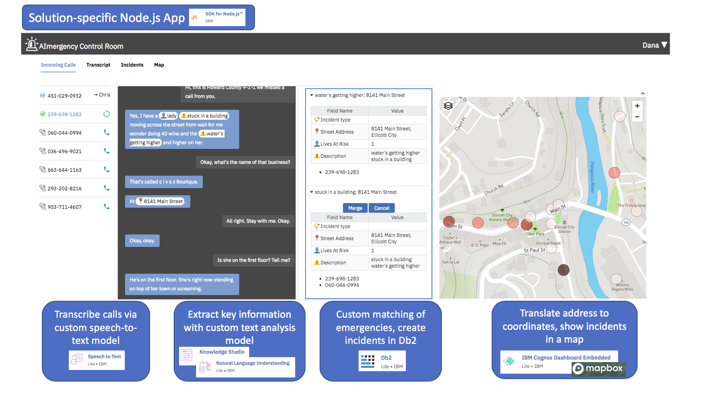
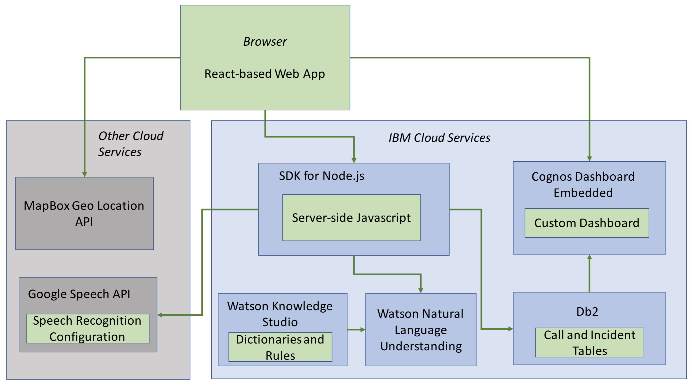

# AI-mergency Control Room (AICR), understanding and consolidating requests for help with Watson

IBMers Alexander Lang and Tim Reiser talk about their Call For Code entry, AI-mergency, harnessing artifical intelligence and natural language processing to quickly process and map call center activity to more successfully deploy rescue operations.

Blog: [Helping dispatchers deploy rescue teams faster](https://developer.ibm.com/blogs/2018/10/17/supporting-dispatchers-to-deploy-rescue-teams-faster/)

## What it does

Human dispatchers are key to an efficient emergency response. The goal of **AI-mergency control room (AICR)** is to ensure dispatchers stay productive during emergencies. AICR is a web application that supports the dispatcher during the complete workflow of handling an emergency:
1. AICR automatically transcribes incoming emergency calls. 
2. While the dispatcher talks to the caller, AICR extracts key information in real time, which the dispatcher can easily edit or enhance:
   1. Where is the emergency?
   2. What has happened? 
   3. How many lives are in danger? 
3. AICR maps the extracted emergency address information to precise latitude/longitude coordinates for better routing of rescue teams. 
4. AICR matches the call to existing emergencies, to help the dispatcher identify whether the call refers to a new incident or is talking about an already known emergency. 
5. AICR prioritizes the emergency across all other emergencies, based on the extracted information. This prioritization can of course be changed by the dispatcher. 
6. AICR shows the emergency on a map, in context of other incidents, to help the dispatcher check for rescue teams that are already deployed in the area, and to see emerging hotspots. 
7. AICR stores all emergencies and call transcripts in a database to provide full visibility and traceability of the events during and after a disaster.  

This way, AICR prevents “dispatcher fatigue”, and allows less-skilled dispatchers that are brought into the disaster area to become productive more rapidly.

## How it is done

### Architecture Overview

AICR is a web app that uses a variety of cloud services to perform its core
functions. Below is an overview of the app with the various cloud services called
out where they are being used.

Below is a more abstract overview of the AICR components, and how they interact
with each other.

### Component Details

#### Overall server-side orchestration: Node.js

The server side of the app runs in Node.js. This is a relatively thin layer that
routes the various requests from the client to the respective cloud services.
The most complex part is the interaction between the client and the speech-to-text
service, and the client and the natural language understanding service. Since this
is a two-way, asynchronous communication, we employ a websocket.

#### The client side: React

The browser app uses the React Javascript library to build an interactive application.
In addition to React, we use a small number of other libraries. For styling, we
use plain CSS (without any kind of preprocessor).

#### Call Transcription: Google Speech / Watson Speech to Text

We stream two parallel audio channels to the Google Speech API, one for the
caller and one for the dispatcher. The API returns interim results with a
provisional transcript of the latest input. It also returns final results for
blocks of speech (separated by silence), even before the call ends.
The results also include inferred punctuation.

We use a speech model specifically trained on phone calls and provide the model
with some contextual information (e.g. location names from within the county
limits). At first, we integrated the IBM Watson Speech to Text service.
We spent considerable effort on training both a speech and a language model.
However, we did not manage to get recognition quality to a point that was good
enough for our purposes. It has to be noted though that the sound quality of these
pre-recorded calls is very low. When using a microphone directly, the Watson Speech
service performs quite well. We expect that in a real life scenario, we would get
similarly good results. We have reached out to the Watson team, and
want to switch back to that service as soon as possible.

#### Emergency Incident Storage: Db2

The Db2 database holds information about incoming calls, incidents and response 
teams. The database layout is more comprehensive than what was required for
the demo. This is because we are planning to show more incident status
information via Cognos (see information about the embedded Cognos dashboard below).

#### Information Extraction from Transcripts: Watson Natural Language Understanding and Watson Knowledge Studio

We built a custom model in Watson Knowledge Studio that extracts entities
relevant to the domain of natural disasters.  Mentions of persons, addresses,
and incident details are extracted using dictionaries, regular expressions and
rules, which can be found [here](https://github.com/IBM/AI-mergency/tree/master/Knowledge%20Studio). The model is deployed to the Watson Natural Language Understanding
service and accessed via its Javascript API.

#### Address to Latitude/Longitude Translation: Mapbox Geocoding

The Mapbox Geocoding API takes an address as input and returns its coordinates
as well as a standardized representation of the address. We seed the API with
the coordinates of the Howard County police station, based in Ellicott City, Md. This way, our address translation works well, even for addresses that don't contain any city name, like
*8141 Main Street*, because they're resolved based on proximity to the police station.

#### Map Representation: Cognos Dashboard Embedded

We have created a custom report in Cognos that contains the map, reading the
data from the incidents stored in DB2. Using Cognos Dashboard Embedded will
allow us to overlay additional information in the future, such as areas of
likely flooding and the position of emergency response teams.
We also plan to include additional aggregated information as
Cognos charts, such as the trend of open emergencies over time.

## Try it out

### Using the AI-mergency control room on IBM Cloud

Please note: all instances of the app use a single database in the background,
just as in real life. This means that any time anyone runs the demo, they will
add the same incident to the DB, and the demo will not work properly for the
next person. For that reason, there is a `Reset Demo Database` button at the 
bottom of the screen. As you would expect, this resets the database to its
original state. If when you start the demo, the top incident is for `8141 Main 
Street`, you should press the reset button so the demo works properly for you.
If you have run the demo yourself, and would like to run it again, please click
the button *and also reload the page*. When you reload the page, the buttons
for accepting the recorded phone calls will reappear.

1. Go to https://aimergency-control-room.mybluemix.net/
2. Under 'Incoming Calls', click on the first call (number `239-698-1283`)
3. Listen to the call, and observe how transcript and incident info get created. 
4. Observe that a new marker is added to the map. To see the map completely, click the `Map`tab at the top of the screen.
6. Once the call has ended, it is removed from the call list.
7. Under 'Incoming Calls', click on the next call, which is now the first
   in the list of incoming calls (number `060-044-0994`)
8. Once the caller address is recognized, you can elect to merge this call with the previous one or you can keep it
   separate by clicking 'Cancel'.
9. Press the `Reset Demo Database` button at the bottom of the screen.

### Running the AI-mergency control room locally

1. Clone the repository.
2. Follow the instructions below to to create your own instances of the required services.
3. Ensure that you have `npm` installed
   and that you are using `node` in version 8.
4. Navigate to the repository's `node_app` directory and run `npm install`.
   This will take a while.
5. Start the app with `npm start`.
6. Use your browser to navigate to `localhost:3000` and try the app.
   Don't forget to enable sound!

#### Creating the required service instances

**Db2 / Watson Natural Language Understanding / Cognos Dashboard Embedded**

1. Go to https://www.ibm.com/cloud/ and sign-in or create a new cloud account.
2. Click 'Create resource' to create instances of the following services:
    1. Db2 Lite
    2. IBM Cognos Dashboard Embedded
    3. Natural Language Understanding
3. For each service instance, go to 'Service credentials' and click 'New credential' to get your service credentials. Enter the required credentials in the corresponding configuration file:
    1. `node_app/db-credentials.json`: Enter `ssldsn` from your json creds as `connectionString`
    2. `node_app/daas-credentials.json`
    3. `node_app/nlu-credentials.json`
    
**Mapbox Geocoding**

Go to https://www.mapbox.com/ and sign-up to get an access token. Enter your access token in the Mapbox configuration file`node_app/pulic/scripts/mapbox-credentials.json`.

**Google Speech**

Go to https://cloud.google.com/speech-to-text and follow the Quickstart guide to get your credentials for Google Cloud Speech-to-Text. Enter your credentials in the Google Speech configuration file `node_app/google-speech-credentials.json`.
